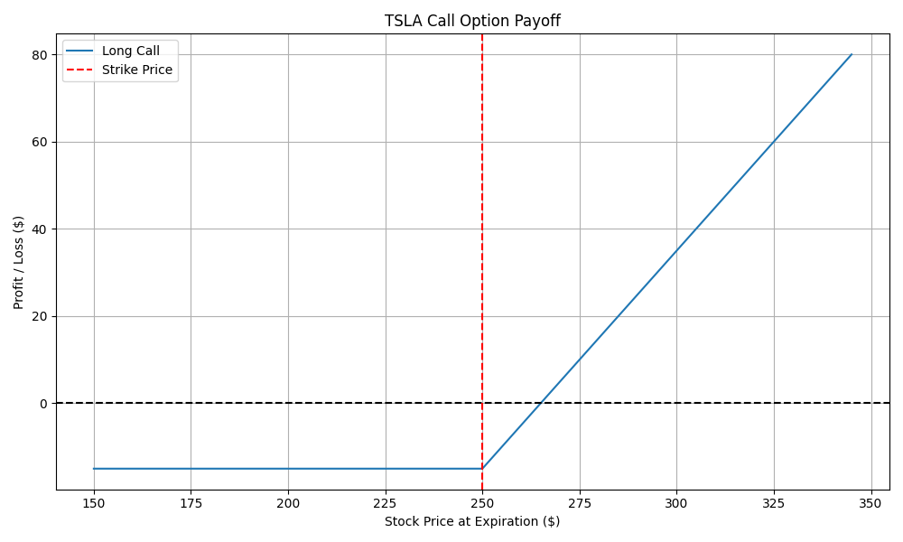

#  Options Payoff Simulator

A Python tool that simulates profit and loss (PnL) for **long call options** using live option chain data from Yahoo Finance. Designed to help traders understand breakeven points, expiration outcomes, and visualize strategy risk-reward.

---

##  Features

-  Pulls real-time options data via `yfinance`
-  Generates payoff plots using `matplotlib`
-  Highlights breakeven and strike price levels
-  Exports charts as PNGs for analysis

---

##  Example Output



---

##  How to Run

### 1. Install dependencies:
```bash
pip install -r requirements.txt
